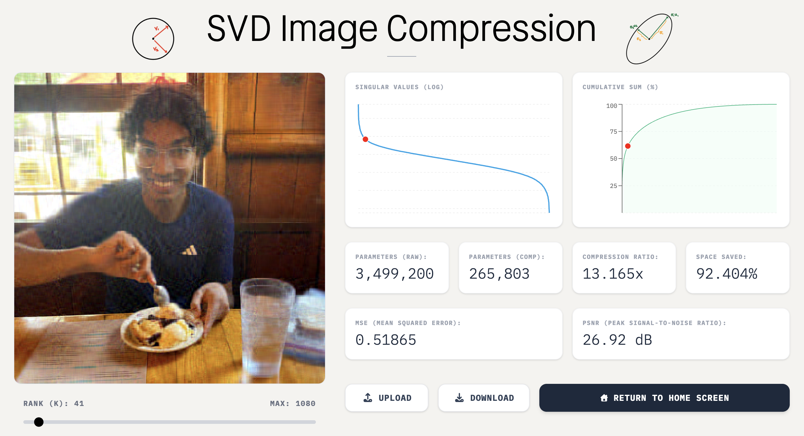

# Image Compression SVD

An interactive tool to simulate image compression using singular value decomposition

## About

Image compression is a widely studied problem in graphics and data visualization. It involves manipulating an image's numerical representation to reduce it's storage or transmission. Many algorithms (Transform Coding, Wavelet Transform, Huffman Coding, etc.) exist that take advantage of visual perception or statistical properties of image data to achieve this.

This project uses singular value decomposition, a classical method of **unsupervised learning**, to reduce an image's rank, when represented as a matrix. Deeply rooted in linear algebra, SVD reduces a matrix's rank while preserving as much as information as possible. It can be proven (see "Mathematical Formalism") that a rank-k approximation using SVD minimizes the MSE (mean squared error) between the true and approximate construction for any approximation matrix of rank k. Therefore, as k increases, our k-approximation gets more and more accurate.

In addition to computing SVD of templates or any user-selected image, this project provides a dashboard to visualize how the k-approximation changes with k. The dashboard contains graphs that track the singular values in order of importance. Additionally, we provide insightful statistics into how this tool can be used for image compression, noting that a lower k value requires fewer parameters to store the image. Users can explore altering k, and see visually how the generated image and space required to store it change.

To my knowledege, this is the first tool publicly available that computes and displays such statistics in an interactive manner using simple, modern frameworks.

Feel free to explore the tool from the following link: [https://hishambhatti.github.io/image-compression-svd/](https://hishambhatti.github.io/image-compression-svd/)

## Theorem

For any matrix $A \in \mathbb{R}^{m \times n}$, there exists matrices $U \in \mathbb{R}^{m \times r}, S \in \mathbb{R}_{\ge 0}^{r \times r}, V^\top \in \mathbb{R}^{r \times n}$ such that
$$ A = U S V^\top$$

where $r = \min(m, n)$. For a rank-$k$ approximation where $1 \le k \le r$, the approximation $A_k$ is computed by matrix-multiplying the first $k$ columns of $U$, the $k \times k$ diagonal submatrix of $S$ and the first $k$ rows of $V^\top$.

## Key Design Decisions

SVD is not a fast algorithm, taking $O(\max (m,n)\cdot \min (m,n)^{2})$ time. Therefore, designing a tool to run relatively quickly on the browser involved several engineering decisions, some with a strong theoretical backing and others purely empirical. For those interested, we list some of them here:

- Precompute $U \cdot S$ during loading. The SVD decomposition $A = U S V^\top$ involves two matrix multiplications. Precomputing $US$ allows us to choose the first $k$ columns and only compute one product with $V^\top$.
- Introducing a buffer time between renders (2 MS -> 500 FPS). This prevents overload of $k$ values to be computed when a user moves the slider quickly.
- Since larger $k$ values involve larger matrices being multiplied, naive multiplication results in significant inconsistencies, with higher $k$ values lagging. Using matrix algebra, we can rewrite the SVD as a sum of rank-1 outer products. We precompute these outer products during loading time.

$$ A = \sum_{i=1}^r s_i u_i {v_i}^\top$$

- Rather than adding $k$ rank-1 matrices for every chosen value of $k$, we only need to add $\Delta k$ rank-1 matrices, where $\Delta k$ is the difference between the previous $k$ value and the one being changed. This makes computation for slow-speed sliding near-instant, as $\Delta k$ is small (within our framerate).
- Even with this, there is a problem of if we click to a higher $k$ or if $\Delta k$ is large. We have a dilemma. A full precomputation of every rank-1 sum from 1 to $k$ for all $k$ has *fast runtime* but *high memory*. An on the fly computation for every $k$ has *low memory* but *slow runtime*. We compromise by using *block-rank* SVD. During loading time, we iterate once and compute the rank sums from 1 to $r$, but only cache multiples of 25.

**Precomputing the SVD reconstruction for multiples of 25, combined with rank-1 updates for small changes, ensures that our simulation runs quickly and does not consume too much memory.**

- Downsample user-given images that are too large. As this is for demonstration purposes, downsampling large images avoids the problem of having to tune the block size and framerate for specific sizes of images, and maintains the integrity of the project.

I decided not to use GPU acceleration such as WebGPU and WebGL, as they are complicated, inconsistent with certain browsers, and does not offer significant gains for the purpose of this demonstration.

## Credit

Developed by [Hisham Bhatti](https://www.linkedin.com/in/hisham-bhatti)!

Most of the images were designed or taken by Hisham. Credit to Rishit Khare for the snazzy bookshelf pixel art

### Built With

### Libraries
- svd-js
- recharts